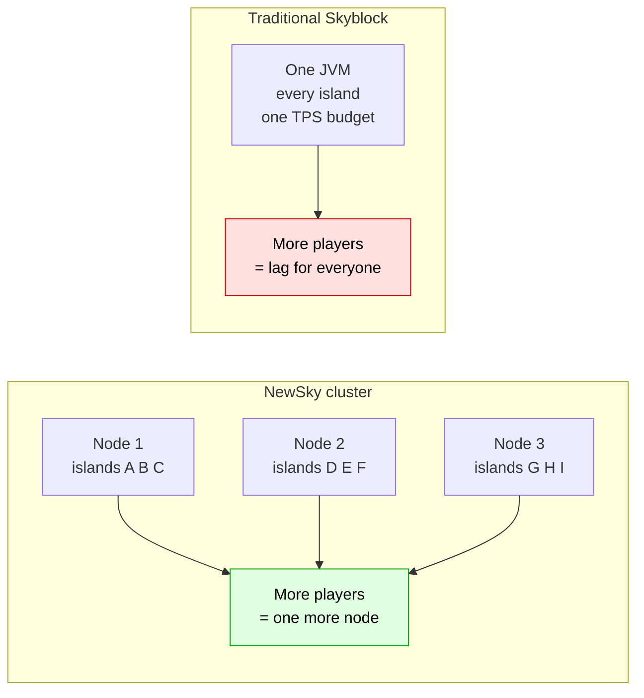
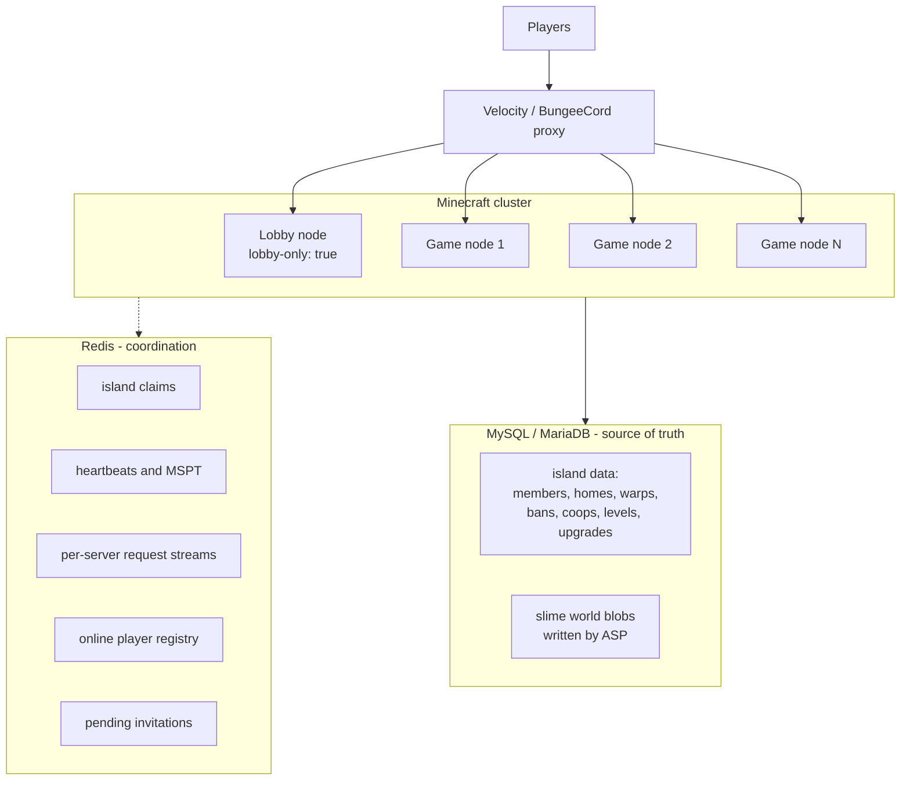
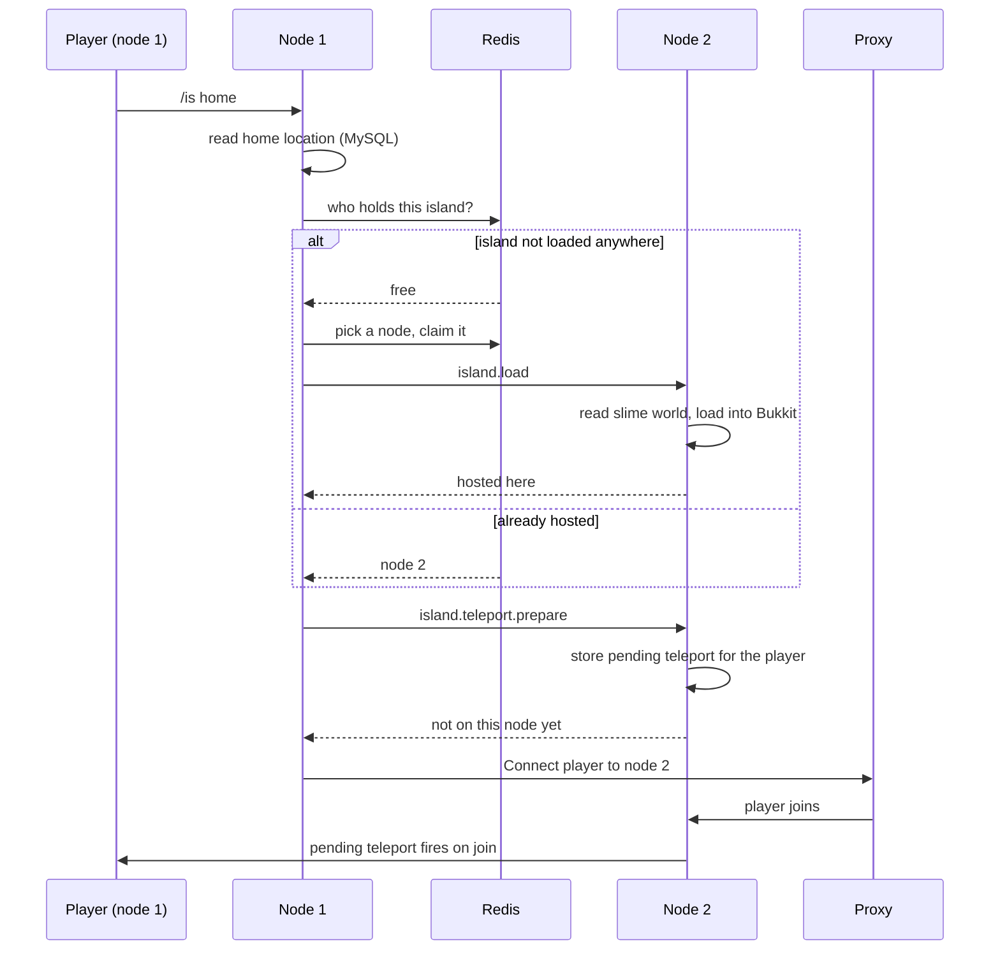
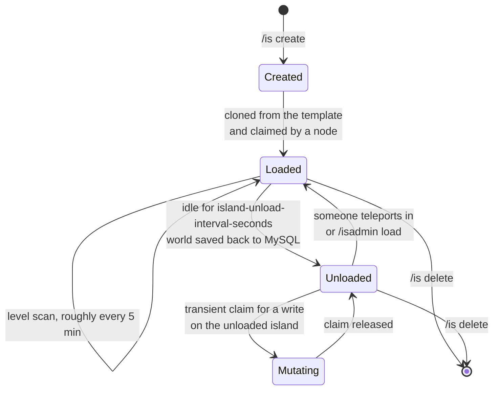
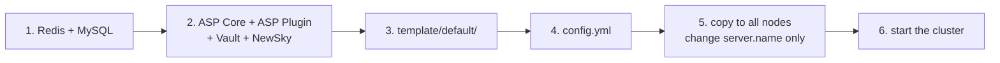

<h1 align="center">
  
  NewSky
</h1>

<p align="center"><strong>A horizontally scalable, multi-server Skyblock engine for Paper.</strong></p>

<p align="center">
  
  
  
  
</p>

<p align="center">
  
  
  
  
  
</p>

---

> [!WARNING]
> **NewSky is in ALPHA.** The data model and Redis protocol can still change between commits.
> Run it on a test network first, and keep backups of your MySQL database.

---

## Table of contents

- [What NewSky is](#what-newsky-is)
- [Architecture](#architecture)
- [How a teleport actually works](#how-a-teleport-actually-works)
- [Island lifecycle](#island-lifecycle)
- [Features](#features)
- [Requirements](#requirements)
- [Installation](#installation)
- [Configuration](#configuration)
- [Commands](#commands)
- [Permissions](#permissions)
- [Upgrades](#upgrades)
- [Limits](#limits)
- [Island level](#island-level)
- [PlaceholderAPI](#placeholderapi)
- [Developer API](#developer-api)
- [Data stores](#data-stores)
- [Building from source](#building-from-source)
- [Troubleshooting](#troubleshooting)
- [Contributing](#contributing)
- [License](#license)

---

## What NewSky is

Most Skyblock plugins put every island in one server process. That works until it doesn't: a
few hundred loaded islands in a single JVM means one redstone farm can cost everyone else
their TPS, and the only way out is to cap the player count.

NewSky spreads islands across a **cluster of Paper servers**. Each island world lives on
exactly one node at a time, Redis holds the claim that says *which* node, and MySQL holds the
island data plus the world blobs themselves. Adding capacity means adding a server — no
resharding, no per-island configuration.



**What you get**

- One overloaded island hurts one node, not the network.
- Island worlds load on demand and unload when nobody is on them.
- A player runs `/is home` anywhere and lands on the island, wherever it is hosted.
- Capacity scales by starting another server with the same config.

---

## Architecture

Every game node runs the same JAR with the same config; only `server.name` differs. Redis is
the coordination layer, MySQL is the source of truth, and your proxy moves the player.



**The pieces**

| Layer | What it does |
| --- | --- |
| **Claim registry** (Redis hash + Lua) | One field per island naming its holder. A *host* value means the world is loaded there; a *transient* value means a server is mutating an unloaded island. Waiters queue FIFO per island. Nothing mutates an island without holding its claim. |
| **Cross-server messenger** (Redis Streams) | Each server consumes its own inbox key. Requests carry a JSON payload and get a reply; they time out after 30s. Entries from before a restart are dropped instead of replayed. |
| **Server registry** (heartbeats) | Every node writes a TTL key every `heartbeat-interval-seconds`. A node with no heartbeat is not selectable, and its transient claims are treated as dead. |
| **Server selector** | `random`, `round-robin` or `mspt` — decides which node hosts a newly loaded island. |
| **Island snapshot** | Per-node cache of the islands hosted there, read on every block break, PvP hit and world change. Fails closed when unavailable. |
| **World handler** (ASP) | Clones the vanilla template world into a slime world per island and stores it in MySQL through ASP's MySQL loader. |

Island worlds are named `island-<uuid>`, so a world name is enough to resolve the island
without a database lookup.

---

## How a teleport actually works

A player on node 1 runs `/is home` while their island is hosted on node 2:



If the player is offline, the pending teleport simply fires the next time they join the host
node. If the island moved hosts while the request was in flight, the routing is retried
against the new host rather than failing.

---

## Island lifecycle



Unloading saves the slime world back to MySQL first. On shutdown every island world hosted by
that node is unloaded and saved.

---

## Features

| | Feature |
| --- | --- |
| 🌐 | **Multi-server by design** — islands are distributed across the cluster, not pinned to one box |
| 🔀 | **Automatic routing** — every command finds the island's host node, or loads it somewhere sensible |
| 💤 | **On-demand worlds** — islands load when needed and unload when idle |
| 👥 | **Teams, co-op, bans, expel, lock, PvP toggle** — all cluster-aware |
| 🏠 | **Per-member homes and per-island warps** |
| 📈 | **Island levels** from a configurable block value table, plus `/is top` and rank placeholders |
| ⬆️ | **Upgrades** — island size, team/co-op/home/warp limits, biome unlocks, generator rates, paid through Vault |
| 🧱 | **Per-island block and entity limits** |
| 🌱 | **Cobblestone generator rates** by upgrade level |
| 🗺️ | **Biome changer** per chunk, restricted to unlocked biomes |
| 🛡️ | **Protection listeners** for build, interact, explosion, vehicle, hanging and PvP |
| 🔤 | **PlaceholderAPI expansion** including a level leaderboard |
| 🧩 | **Public async API** for other plugins |
| 🎨 | **Fully configurable** commands, aliases, permissions and MiniMessage-formatted messages |

---

## Requirements

| | Component | Notes |
| --- | --- | --- |
| ✅ | **Java 21** | |
| ✅ | **AdvancedSlimePaper Core 1.21.11** | the server JAR, replaces Paper — [download](https://infernalsuite.com/download/asp/) |
| ✅ | **AdvancedSlimePaper Plugin 1.21.11** | must load before NewSky — [download](https://infernalsuite.com/download/asp/) |
| ✅ | **Redis** | reachable from every node in the cluster |
| ✅ | **MySQL or MariaDB** | reachable from every node; also stores the slime worlds |
| ✅ | **Vault** + an economy plugin | upgrades are paid for through Vault |
| ✅ | **Velocity or BungeeCord** | NewSky moves players with the `BungeeCord` plugin channel |
| 🔁 | **PlaceholderAPI** | optional; the expansion registers itself when present |

> [!NOTE]
> Folia is **not** supported (`folia-supported: false`).

---

## Installation

### 1. Prepare the infrastructure

Redis and MySQL must be reachable from **every** node. Create an empty database, for example
`newsky` — NewSky creates its own tables on first start, and ASP creates its world tables in
the same database.

### 2. Install on one node

Drop the JARs in, start the server once so the YAML files are generated, then stop it. This
is how the node looks when it is fully set up:

```
server/
├── AdvancedSlimePaper.jar          <- the server JAR (ASP Core)
└── plugins/
    ├── ASPaperPlugin.jar           <- ASP plugin, loads before NewSky
    ├── Vault.jar
    ├── NewSky.jar
    └── NewSky/
        ├── config.yml              <- generated on first start
        ├── commands.yml
        ├── messages.yml
        ├── levels.yml
        ├── limits.yml
        ├── upgrades.yml
        └── template/
            └── default/            <- your island template (a vanilla world folder)
                ├── level.dat
                └── region/
```

> [!NOTE]
> That very first start writes all six YAML files and then **disables the plugin** with
> `Template world folder not found` — the template does not exist yet. That is expected;
> step 3 fixes it.

### 3. Provide the island template

`island.template` names a folder under `plugins/NewSky/template/`. Put a **vanilla world
folder** there — the folder that contains `level.dat` and `region/`. It is read once at
startup and cloned for every new island; it is never written to.

Build your starter island in a normal world, stop the server, and copy that world folder in.
A missing template fails startup on any node that is not `lobby-only`.

### 4. Configure

Edit `config.yml` — Redis, MySQL, the lobby section and `server.name`.

```yaml
server:
  name: "server1"      # must match the name in your proxy config
  lobby-only: false    # true on lobby nodes: they never host islands
```

You do **not** need to configure the AdvancedSlimePaper plugin; NewSky drives it directly.

### 5. Copy to every node

Copy the whole `plugins/NewSky/` folder to every server in the cluster and change **only**
`server.name` on each one (and `lobby-only` on lobby nodes). Redis, MySQL and every gameplay
section must be identical across the cluster.

### 6. Start everything

Start the nodes and check the log for `Plugin enabled!`. Run `/is create` to test.



---

## Configuration

| File | What it holds |
| --- | --- |
| `config.yml` | server identity, Redis, MySQL, network/heartbeat, lobby fallback, island defaults |
| `commands.yml` | every sub-command's aliases, permission node, syntax and description |
| `messages.yml` | every message, MiniMessage formatted |
| `levels.yml` | point value of each block for the island level |
| `limits.yml` | per-island block and entity caps |
| `upgrades.yml` | upgrade levels, prices, requirements and what each level grants |

`/isadmin reload` re-reads the config files.

### Key `config.yml` sections

<details>
<summary><b>Server identity</b> — the only section that differs per node</summary>

```yaml
server:
  name: "server1"      # must match your BungeeCord / Velocity server name
  lobby-only: false    # true = never hosts islands
```
</details>

<details>
<summary><b>Network and server selection</b></summary>

```yaml
network:
  heartbeat-interval-seconds: 5
  selector: "round-robin"            # random | round-robin | mspt
  mspt-update-interval-seconds: 10   # only used by the mspt selector
```

| Selector | Behaviour |
| --- | --- |
| `random` | picks any live game node |
| `round-robin` | spreads islands evenly through a shared Redis counter |
| `mspt` | picks the node with the lowest reported MSPT |
</details>

<details>
<summary><b>Lobby fallback</b> — where players go when they must leave an island</summary>

```yaml
lobby:
  server-names: ["lobby"]   # proxy server names; multiple = load balanced
  world-name: "world"
  location: { x: 0.0, y: 100.0, z: 0.0, yaw: 0.0, pitch: 0.0 }
```

Used when an island is unloaded, deleted or locked under a player's feet, and when someone is
expelled or banned.
</details>

<details>
<summary><b>Island defaults</b></summary>

```yaml
island:
  template: "default"
  spawn: { x: 0, y: 132, z: 0, yaw: 180, pitch: 0 }
  island-unload-interval-seconds: 300
  gamerules:
    keep_inventory: true
    immediate_respawn: false
```
</details>

<details>
<summary><b>Database and Redis</b></summary>

```yaml
mysql:
  host: "localhost"
  port: 3306
  database: "newsky"
  username: "root"
  password: "password"
  use-ssl: false
  properties: "autoReconnect=true&useUnicode=true&characterEncoding=utf8&connectTimeout=10000&socketTimeout=60000"
  prefix: "newsky_"

redis:
  host: "localhost"
  port: 6379
  password: ""
  database: 0          # separate independent NewSky networks by database number
```

`socketTimeout` bounds a query whose reply never arrives. Keep it **above** the database
server's `innodb_lock_wait_timeout` (50s by default) so a genuine row-lock wait still ends in
InnoDB's own error instead of a killed socket.
</details>

---

## Commands

Base command: `/island`, alias `/is`. Admin: `/islandadmin`, alias `/isadmin`.
`command.base-command-mode` decides whether a bare `/is` shows help or teleports home.

### Player

| Command | Permission (`newsky.island.player.*`) | Description |
| --- | --- | --- |
| `/is create` | `.create` | Create a new island |
| `/is delete` | `.delete` | Delete your island |
| `/is setowner <player>` | `.setowner` | Hand ownership to a member |
| `/is leave` | `.leave` | Leave the island you belong to |
| `/is invite <player>` | `.invite` | Invite a player to your island |
| `/is accept` | `.accept` | Accept a pending invitation |
| `/is reject` | `.reject` | Reject a pending invitation |
| `/is removemember <player>` | `.removemember` | Remove a member |
| `/is expel <player>` | `.expel` | Send a visitor back to the lobby |
| `/is coop <player>` | `.coop` | Grant co-op access |
| `/is uncoop <player>` | `.uncoop` | Revoke co-op access |
| `/is cooplist` | `.cooplist` | List co-op players |
| `/is ban <player>` | `.ban` | Ban a player from your island |
| `/is unban <player>` | `.unban` | Unban a player |
| `/is banlist` | `.banlist` | List banned players |
| `/is lock` | `.lock` | Toggle the island lock |
| `/is pvp` | `.pvp` | Toggle PvP |
| `/is sethome [name]` | `.sethome` | Set one of your homes |
| `/is delhome <name>` | `.delhome` | Delete one of your homes |
| `/is home [name]` *(alias `go`)* | `.home` | Teleport to your home |
| `/is setwarp [name]` | `.setwarp` | Set an island warp |
| `/is delwarp <name>` | `.delwarp` | Delete an island warp |
| `/is warp <player> [name]` | `.warp` | Teleport to another island's warp |
| `/is info [player]` | `.info` | Show island information |
| `/is level` | `.level` | Show your island level |
| `/is top` | `.top` | Island leaderboard by level |
| `/is value` | `.value` | Point value of the block in your hand |
| `/is upgrade <id> [buy]` | `.upgrade` | View or buy an upgrade |
| `/is biome <biome>` | `.biome` | Set the biome of the chunk you stand in |
| `/is lobby` | `.lobby` | Go back to the lobby |
| `/is help [page]` | `.help` | Command list |

### Admin

| Command | Permission (`newsky.island.admin.*`) | Description |
| --- | --- | --- |
| `/isadmin create <player>` | `.create` | Create an island for a player |
| `/isadmin delete <player>` | `.delete` | Delete a player's island |
| `/isadmin load <player>` | `.load` | Load an island onto a node |
| `/isadmin unload <player>` | `.unload` | Unload an island |
| `/isadmin addmember <member> <owner>` | `.addmember` | Force-add a member |
| `/isadmin removemember <member> <owner>` | `.removemember` | Force-remove a member |
| `/isadmin coop <owner> <player>` | `.coop` | Add a co-op player |
| `/isadmin uncoop <owner> <player>` | `.uncoop` | Remove a co-op player |
| `/isadmin ban <owner> <player>` | `.ban` | Ban from an island |
| `/isadmin unban <owner> <player>` | `.unban` | Unban from an island |
| `/isadmin lock <player>` | `.lock` | Toggle an island's lock |
| `/isadmin pvp <player>` | `.pvp` | Toggle an island's PvP |
| `/isadmin sethome <player> <home>` | `.sethome` | Set a home at your location |
| `/isadmin delhome <player> <home>` | `.delhome` | Delete a home |
| `/isadmin home <player> [home] [target]` | `.home` | Send someone to a home |
| `/isadmin setwarp <player> <warp>` | `.setwarp` | Set a warp at your location |
| `/isadmin delwarp <player> <warp>` | `.delwarp` | Delete a warp |
| `/isadmin warp <player> [warp] [target]` | `.warp` | Send someone to a warp |
| `/isadmin upgrade <player> <id> [set <level>]` | `.upgrade` | View or set an upgrade level |
| `/isadmin biome <biome>` | `.biome` | Set the biome of the chunk you stand in |
| `/isadmin lobby <player>` | `.lobby` | Send a player to the lobby |
| `/isadmin reload` | `.reload` | Reload the config files |
| `/isadmin help [page]` | `.help` | Admin command list |

---

## Permissions

Permission nodes live in `commands.yml`, one per sub-command. Change them there and grant the
new nodes in your permissions plugin — NewSky does not register wildcards for you.

```
newsky.island.player.<subcommand>
newsky.island.admin.<subcommand>
```

Operators bypass island access and protection checks.

---

## Upgrades

`/is upgrade <id>` shows the current level, what the next one grants, its price and the island
level it requires. `/is upgrade <id> buy` charges the buying member through Vault. Any member
can buy; the upgrade belongs to the island.

| Upgrade id | What a level grants |
| --- | --- |
| `island-size` | Island width in blocks — also the world border and the protection boundary |
| `team-limit` | Maximum island players, owner included |
| `coop-limit` | Maximum co-op players |
| `home-limit` | Maximum homes **per member** |
| `warp-limit` | Maximum warps per island |
| `biomes` | The biome list `/is biome` accepts |
| `generator-rates` | Block weights rolled when lava meets water |

Levels are consecutive integer keys in `upgrades.yml`. Level `1` is the default for an island
with nothing stored and needs neither a price nor a requirement.

```yaml
upgrades:
  island-size:
    '1':
      size: 75
    '2':
      require-level: 200
      price: 60000
      size: 100
```

Purchases are written with a compare-and-set against the level the player was shown, so two
members buying at the same moment cannot both be charged for the same level.

---

## Limits

`limits.yml` caps what an island may hold. Keys are Bukkit `Material` / `EntityType` names; an
unknown name or a negative value **fails startup**. `0` forbids the block or entity outright,
and anything not listed is unlimited.

```yaml
limit:
  blocks:
    HOPPER: 50
    PISTON: 500
  entities:
    MINECART: 20
    ARMOR_STAND: 50
```

Block counts ride the periodic level scan and are adjusted live on place, break and burn.
Until an island's first scan completes, block limits **fail closed**. Entity limits are
checked when a creature spawns and when a player places a vehicle, armor stand or hanging.

---

## Island level

`levels.yml` gives every block a point value. A scan of the island runs roughly every five
minutes per loaded island (jittered, at most five concurrent per node), sums the blocks inside
the border and stores the level in MySQL.

- `/is level` — your island's stored level
- `/is value` — what the block in your hand is worth
- `/is top` — leaderboard, level descending, island UUID ascending for ties

The stored level is what upgrade requirements and placeholders read; no command triggers a
scan on demand.

---

## PlaceholderAPI

Install PlaceholderAPI and restart. The expansion registers itself and survives
`/papi reload` — no eCloud download.

### Island placeholders

Player placeholders describe the player's own island, regardless of the world they are in.

| Placeholder | Value |
| --- | --- |
| `%newsky_island_level%` | Last stored island level (does not trigger a scan) |
| `%newsky_island_members%` | Member count, excluding the owner and co-op players |
| `%newsky_island_owner%` | Owner's last known name, or their UUID |
| `%newsky_island_owner_uuid%` | Owner UUID |
| `%newsky_island_uuid%` | Island UUID |
| `%newsky_island_role%` | `owner`, `member` or `none` (co-op is not membership) |
| `%newsky_island_lock%` | `true` / `false` |
| `%newsky_island_pvp%` | `true` / `false` |
| `%newsky_island_players%` | Owner plus members, excluding co-op players |
| `%newsky_island_coops%` | Co-op player count |
| `%newsky_island_bans%` | Banned player count |
| `%newsky_island_rank%` | Position in the level leaderboard; `0` with no island |

### Upgrade placeholders

`<id>` is an upgrade id from `upgrades.yml` (`island-size`, `team-limit`, `coop-limit`,
`home-limit`, `warp-limit`, `biomes`, `generator-rates`).

| Placeholder | Value |
| --- | --- |
| `%newsky_upgrade_<id>_level%` | The island's current level |
| `%newsky_upgrade_<id>_value%` | What the current level grants |
| `%newsky_upgrade_<id>_max%` | Highest configured level |
| `%newsky_upgrade_<id>_maxed%` | `true` at the highest level |
| `%newsky_upgrade_<id>_next_price%` | Price of the next level, as a plain number |
| `%newsky_upgrade_<id>_next_require_level%` | Island level needed for the next level |
| `%newsky_upgrade_<id>_next_value%` | What the next level grants |

`max` needs no island. Every other field is empty for a player without one, and the `next_*`
fields are empty once the upgrade is maxed.

### Leaderboard placeholders

These work without a player, so they are usable in lobby holograms.

| Placeholder | Value |
| --- | --- |
| `%newsky_top_1_owner%` | Owner name at position 1, or UUID if unknown |
| `%newsky_top_1_level%` | Island level at position 1 |
| `%newsky_top_1_uuid%` | Island UUID at position 1 |
| `%newsky_top_1_members%` | Member count at position 1, excluding the owner |

Replace `1` with any positive position. Ordering follows `/is top`; islands with no stored
level count as `0`, so every island has a distinct position. Missing positions return an empty
string.

<details>
<summary><b>Loading and caching behaviour</b></summary>

Only the data a requested placeholder needs is loaded, asynchronously. Player-to-island
lookups and island data refresh on demand after thirty seconds; island data is shared by island
UUID within each server. Counts and lists share their underlying data, and player names are
fetched only when displayed — showing only the island level reads the player's island UUID and
the shared level, nothing else.

The first request returns an empty string while loading; refreshes serve the previous values.
With no island, numbers return `0`, booleans `false`, role `none`, and names, UUIDs and lists
an empty string. Player placeholders with no player return an empty string. Database failures
are logged and return empty values until a refresh succeeds. Unused cache entries are cleaned
up periodically. Leaderboard data is shared across requests and expands to the highest
requested position; it and island rank refresh on demand after thirty seconds.

Lists are comma-separated and sorted by name, ignoring case. Unknown names fall back to UUIDs.

Test in game with `/papi parse me %newsky_island_level%`, repeating after the initial load.
</details>

---

## Developer API

Everything is asynchronous and returns `CompletableFuture`. Failures arrive as completion
exceptions carrying the typed exceptions in `org.me.newsky.exceptions`
(`IslandDoesNotExistException`, `NoActiveServerException`, `TeamLimitReachedException`, …).

```java
NewSky newSky = (NewSky) Bukkit.getPluginManager().getPlugin("NewSky");
NewSkyAPI api = newSky.getApi();

// Reads live on the API itself.
api.getIslandUuid(playerUuid)
   .thenCompose(api::getIslandLevel)
   .thenAccept(level -> player.sendMessage("Island level: " + level));

// Writes go through a handle that decides who is acting.
api.player(playerUuid).createIsland();                              // acts as that player, on their island
api.player(playerUuid).setHome("main", worldName, x, y, z, yaw, pitch);
api.admin(sender).deleteIsland(islandUuid);                         // arbitrary target, sender's name in logs
api.admin(sender).setUpgradeLevel(islandUuid, "island-size", 3);
```

The split is the whole design: `player(uuid)` can only act as that player on that player's own
island — anything else is unrepresentable rather than merely rejected. `admin(sender)` takes
arbitrary targets and carries the sender's name into logs and cross-server payloads.

> [!TIP]
> Completions can land on an async thread. Hop back to the main thread yourself before
> touching world, entity or inventory state.

Add NewSky as a `provided` dependency and declare it in your `paper-plugin.yml` /
`plugin.yml`.

---

## Data stores

### MySQL tables (prefix from `mysql.prefix`, default `newsky_`)

| Table | Contents |
| --- | --- |
| `newsky_islands` | island UUID, lock, PvP |
| `newsky_island_players` | membership and role, one island per player |
| `newsky_island_homes` | per-member homes |
| `newsky_island_warps` | per-island warps |
| `newsky_island_bans` | banned players |
| `newsky_island_coops` | co-op players |
| `newsky_island_levels` | stored island level |
| `newsky_island_upgrades` | per-upgrade level |
| `newsky_player_uuid` | UUID ↔ name cache |

ASP writes the slime world blobs into the same database.

### Redis keys

| Key | Purpose |
| --- | --- |
| `newsky:island:server` | the claim hash — which node holds which island |
| `newsky:island:claimqueue:<island>` | FIFO waiters for one island |
| `newsky:messaging:inbox:<server>` | per-server request stream |
| `newsky:heartbeat:server:<name>` | liveness, TTL based |
| `newsky:heartbeat:game_server:<name>` | liveness for island-hosting nodes only |
| `newsky:servers:known` | known server names |
| `newsky:server:mspt` | reported MSPT per node |
| `newsky:server:round_robin_counter` | round-robin cursor |
| `newsky:online:players` / `newsky:online:player_servers` | cluster-wide presence |
| `newsky:invitation:island:<player>` | pending invitations, TTL based |

Separate independent NewSky networks with `redis.database`.

---

## Building from source

```bash
git clone https://github.com/kit8379/NewSky.git
cd NewSky
mvn clean package
```

The shaded JAR lands at `target/NewSky.jar`. Java 21 is required. Tests run on JUnit 5 with
Mockito and an H2 in-memory database:

```bash
mvn test
```

---

## Troubleshooting

| Symptom | Likely cause |
| --- | --- |
| `Template world folder not found` on startup | `plugins/NewSky/template/<island.template>/` is missing on a node that is not `lobby-only` |
| `No active server found!` in game | no node is sending heartbeats, or every node is `lobby-only` |
| Players land in the wrong lobby | `lobby.server-names` must match your proxy's server names |
| Teleports never move the player | the `BungeeCord` plugin channel is not reachable — check the proxy and that `server.name` matches the proxy config |
| Upgrades say the economy is missing | Vault, or a Vault economy provider, is not installed |
| Islands never unload | players are still in the world; unload is checked every `island-unload-interval-seconds` |
| Block limits reject everything on a fresh island | limits fail closed until the first level scan counts the island — it runs within a few minutes |

Set `debug: true` in `config.yml` for verbose logs.

---

## Contributing

Issues and pull requests are welcome.

- 🐛 **Bugs and features** — [GitHub Issues](https://github.com/kit8379/NewSky/issues)
- 🔧 **Code** — keep the diff small and follow the existing architecture
- 📖 **Docs** — corrections to this README are as useful as code

## Support

- ⭐ Star the repository
- 🍕 [Buy the developer a coffee](https://paypal.me/legendofdestiny)
- 🗣️ Share feedback in the Issues tab

## License

MIT. Fork it, modify it, build on it — please keep the attribution.
